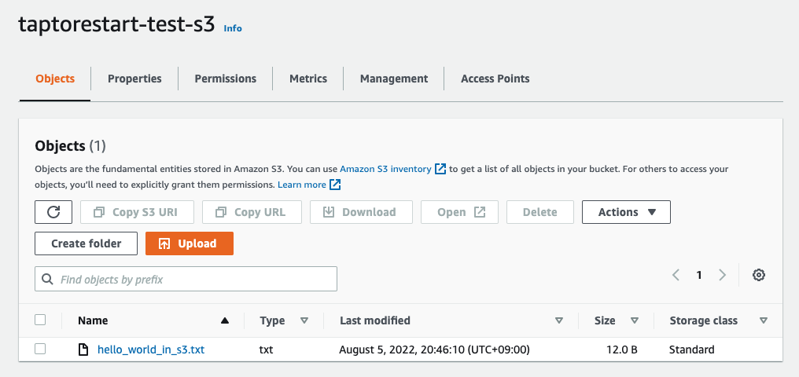

# boto3 documentation
- [Uploading files](https://boto3.amazonaws.com/v1/documentation/api/latest/guide/s3-uploading-files.html)
- [Download files](https://boto3.amazonaws.com/v1/documentation/api/latest/guide/s3-example-download-file.html)

## Environments
- python: v3.8.2
- python-dotenv: v0.20.0
- boto3: v1.24.46

## Install
```shell
$ pip install -r requirements.txt
```

## Run

Please create an .env file in the root directory of your project.

And then write like below.
```
AWS_ACCESS_KEY_ID=Input your access key id here!
AWS_SECRET_ACCESS_KEY=Input your secret access key here!
```

And run upload_to_s3.py!
```shell
$ python upload_to_s3.py
```

You can see the file on S3 like below:



And run download_from_s3.py!
```shell
$ python download_from_s3.py
```

You can see the file 'hello_world_from_s3.txt' on your directory.
