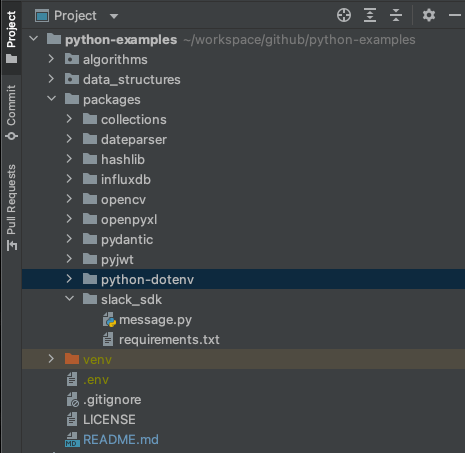

# python-dotenv
- [github page](https://github.com/theskumar/python-dotenv)

## Environments
- python: v3.8.2
- python-dotenv: v0.20.0

## Run

Please create an .env file in the root directory of your project.



And then write like below.
```
username=taptorestart
password=verysecret!
```

And run dotenv.py!
```shell
$ python load_envs.py
```

You can see the result like below.
```shell
taptorestart
verysecret!
```
